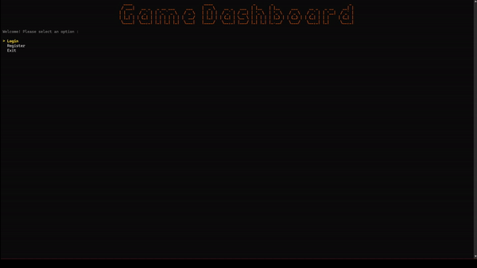

# Games_DashBoard

A robust, console-based Game Library Manager built with **.NET** and **Spectre.Console**. This application allows users to manage their personal game collection by fetching real-time data from the **IGDB API**.

  

## ✨ Key Features

* **Real-Time Data Fetching:** Integrates with the [IGDB API](https://api-docs.igdb.com/) to search for games, retrieve metadata (developers, genres, DLCs).
* **Rich CLI Interface:** Uses `Spectre.Console` for an immersive terminal experience, including spinners, tables, and interactive prompts.
* **User Authentication:** Secure login and registration system using **BCrypt** for password hashing.
* **Library Management:**
    * Add games to your personal collection.
    * Rate games on multiple metrics (Gameplay, Story, Visuals, Audio, Creativity).
    * Sort library by Name or Date Added.
* **Data Persistence:** Asynchronous JSON file storage ensures user data is saved securely without blocking the UI.

## 🛠️ Technical Highlights

This project demonstrates modern C# best practices:
* **Asynchronous Programming:** Fully async/await implementation for File I/O and Network calls to prevent UI blocking.
* **Dependency Management:** Separation of concerns between UI, Services, and Data layers.
* **Security:** Passwords are never stored in plain text; User Secrets are used for API keys.

## 🧠 What I Learned

* **HTTP & API Integration:** This project was my primary focus for mastering `HttpClient`. I learned how to manage request headers for authentication, handle JSON serialization/deserialization, and interact with a professional REST API (IGDB).
* **Connection Management:** I learned the importance of reusing `HttpClient` instances to prevent socket exhaustion in .NET applications.
* **Architecture Refinement:** While I had previous experience with `Spectre.Console` and layered architecture, building this application reinforced those concepts and helped me practice applying the Service-Repository pattern in a more complex, real-world scenario.

## 🚀 Installation

### Option 1: Quick Start (Pre-built Release)
*Best for users who just want to run the app without coding.*

1.  Go to the **[Releases](../../releases)** tab on this repository.
2.  Download the latest `.zip` file (Windows only).
3.  Extract the folder.
4.  **Important:** Open `appsettings.json` in a text editor and add your IGDB Keys (Get the keys from twitch developer portal):
    ```json
    {
      "IGDB": {
        "ClientId": "YOUR_CLIENT_ID_HERE",
        "Token": "YOUR_ACCESS_TOKEN_HERE"
      }
    }
    ```
5.  Double-click `Games_DashBoard.exe` to launch!

### Option 2: Build from Source
*Best for developers who want to modify the code.*

1.  **Clone the repository**
    ```bash
    git clone https://github.com/red-arachnid/Games_Dashboard.git
    ```
2.  **Configure API Keys (User Secrets)**
    ```bash
    cd Games_Dashboard
    dotnet user-secrets init
    dotnet user-secrets set "IGDB:ClientId" "YOUR_CLIENT_ID_HERE"
    dotnet user-secrets set "IGDB:Token" "YOUR_ACCESS_TOKEN_HERE"
    ```
3.  **Build and Run**
    ```bash
    dotnet run
    ```

## 📂 Project Structure

```text
Games_Dashboard/
├── Data/           # JSON Repository & Storage Logic
├── Model/          # Data Models (User, Game, IGDB schemas)
├── Services/       # Business Logic (Auth, IGDB API, Game Management)
├── UI/             # Spectre.Console Screens & Interactions
└── Program.cs      # Entry point & Dependency Injection
```

## 📺 Demo


